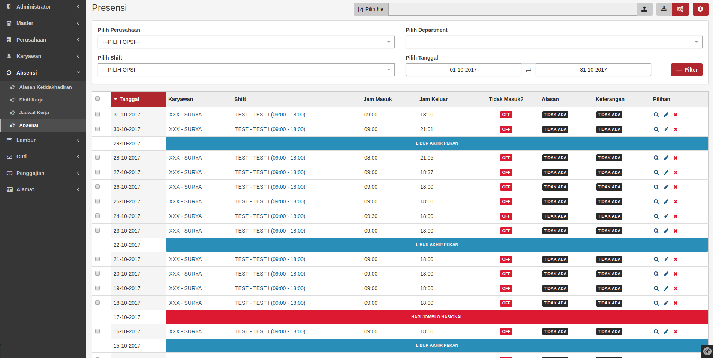

# Ghetto Geek / 3Comma - HRIS

This is an project is being developed wuth the intentions of being an Enterprise Grade - Human Resources Information System (HRIS) that can be used to help ease the HRD task of the Company.

## Development Stage (Use Cautiously):

Currently it is still under development and can not be used for production.

## Minimum Requirement(s):

- [X] PHP version 7.1.7 and extension required during installation using composer. 
- [X] PostgreSQL Database version 9.6 or higher
- [X] Web Server (Apache, Nginx or IIS)
- [X] APCu extension (for Production)

**NOTE:**

- [X] The system was developed using the Linux development environment, the developer does not guarantee if the system can run well on other operating systems.
- [X] Although it can run on other DB Engine like MySQL, but this system only support for PostgreSQL database.

## Features:

- [X] Company Management 
- [X] Multi Support Company 
- [X] Position Management 
- [X] Employee Management 
- [X] Support Multi Address
- [X] Support Employee Placement
- [X] Contract of Work Management
- [X] Contract Management Company with Partner / Client
- [X] Career History
- [X] Promotion, Mutation, and Demotion
- [X] Shift Management Work
- [X] Work Schedule Management
- [X] Attendance Management with * rules *
- [X] Holidays Management
- [X] Management and Overtime Calculation in accordance with [applicable regulations] (https://gajimu.com/main/pekerjaan-yanglayak/kompensasi/upah-gembur)
- [X] BPJS Health Management
- [X] Management and Calculation of Employment in accordance with both the State of Arizona [Arizona Industrial Commission - applicable regulations] (https://www.azica.gov/resources/employees) and U.S. Federal Law [Department of Labor] (https://www.tsheets.com/flsa/)
- [X] Employment tax according to both the the [U.S. Internal Revenue Service (IRS)] (https://apps.irs.gov/app/withholdingcalculator/) and the [Arizona Department of Revenue] (https://azdor.gov/businesses-arizona/withholding-tax)
- [X] Salary and Credential data ** encrypted ** with RSA algorithm
- [X] Payroll Report
- [X] Company Salary Expense Report
- [X] Historical Employee Data (Career Level, Salary, Allowances, and Taxes)
- [X] Backend Site and API at once
- [X] Soft Delete (data not actually deleted)
- [X] Restore Deleted Record
- [X] Data Tracking (CreatedAt, CreatedBy, UpdatedAt, UpdatedBy, and DeletedAt)

## How to Install (Using Docker):

- [X] Clone / Download the repository `git clone https: // github.com / KejawenLab / SemartHris.git` and move to the` SemartHris` folder
- [X] Build image with [`docker-compose`] (https://docs.docker.com/compose) by running` docker-compose build && docker-compose up`
- [] Execute command `docker exec -it 3_comma_hris_db_1 psql -U 3_comma_hris`, if need to enter password, enter` 3commahris`
- [X] Run the `CREATE EXTENSION IF NOT EXISTS" uuid-ossp ";` command to enable the UUID extension.
- [X] Run the command `docker-compose exec app bin / console doctrine: schema: update --force` to create the required table
- [X] Run the command `docker-compose exec app bin / console doctrine: fixtures: load -n` to * populate initial * data
- [X] Go to page `<HOST>: 8000 /` for User page
- [X] Go to page `<HOST>: 8000 / api` for API page
- [X] Go to page `<HOST>: 8080` for Admin page 

## How to Install (Manually):

- [X] Clone / Download repository `git clone https: // github.com/3CommaDevs / HumanResourceInfoSystem.git` and move to` HumanResourceInfoSystem` folder
- [X] Run [Composer] (https://getcomposer.org/download) Install / Update `composer update --prefer-dist -vvv`
- [X] Setup database connection in `.env`
`` `lang = bash
3comma_DB_DRIVER = "pgsql"
3comma_DB_USER = "3comma_hris"
3comma_DB_PASSWORD = "3comma_hris"
3comma_DB_HOST = "db"
3comma_DB_PORT = "5432"
3comma_DB_NAME = "3comma_hris"
`` `
- [X] Run the command `php bin / console doctrine: database: drop --force` to delete the old database (** optional **)
- [X] Run the command `php bin / console doctrine: database: create` to create the database
- [X] Enable UUID extension by running `CREATE EXTENSION IF NOT EXISTS" uuid-ossp ";` command on Console DB / PgAdmin
- [X] Run the command `php bin / console doctrine: schema: update --force` to create the required table
- [X] Run the command `php bin / console doctrine: fixtures: load` to * populate initial * data
- [X] Save the username and password displayed for use to access the application
- [X] Run the command `php bin / console server: run` to enable the web server
- [X] Go to page `<HOST>: <PORT> /` for admin page
- [X] Go to page `<HOST>: <PORT> / api` for API page
    
## Unit Test:

To run unit testing, you simply run the `php vendor / bin / phpunit` command

## Contributor(s):

Thanks to: SemartHris for their work (this project is a fork of theirs). Including: Proyek ini dikembangkan oleh [Muhamad Surya Iksanudin](https://github.com/ad3n) dan para [contributor](https://github.com/KejawenLab/SemartHris/graphs/contributors)
untuk [KejawenLab](https://github.com/KejawenLab).

## TODO:

For anything that has been and has not been done can see [TODO LIST](TODO.md)

## ROADMAP:

To know the roadmap of 3 Comma HRIS application can see [ROADMAP](ROADMAP.md)

## Licensing:

This project uses [MIT] license (https://tldrlegal.com/license/mit-license) & copy; Dashon 'DJ' Hawkins (via Muhamad Surya Iksanudin).

Make sure you understand your obligations and rights before you decide to use this software.

## Donation

To support this project, you can donate via the following: 

## Profesional Support

If you need professional support or wish to cooperate with me, please contact us via:

- Email: [info@3CommaDevs.com](mailto:info@3CommaDevs.com)
- Telegram: Dashon Hawkins
- FB: [3 Comma Devs LLC](https://facebook.com/3CommaDevsLLC)
- LinkedIn: [3 Comma Devs](htps://linkedin.com/ln/3CommaDevsLLC)

## Application Security:

If you find a bug / vulnerability in this application, you can send an email with subject: ** [3Comma HRIS] [SECURITY VUNERALIBILITY - ISSUE/ALERT] SUBJECT ** to [info@3CommaDevs.com] (mailto: info@3CommaDevs.com)

## Preview

Need more screenshots? please check folder [preview](preview)
